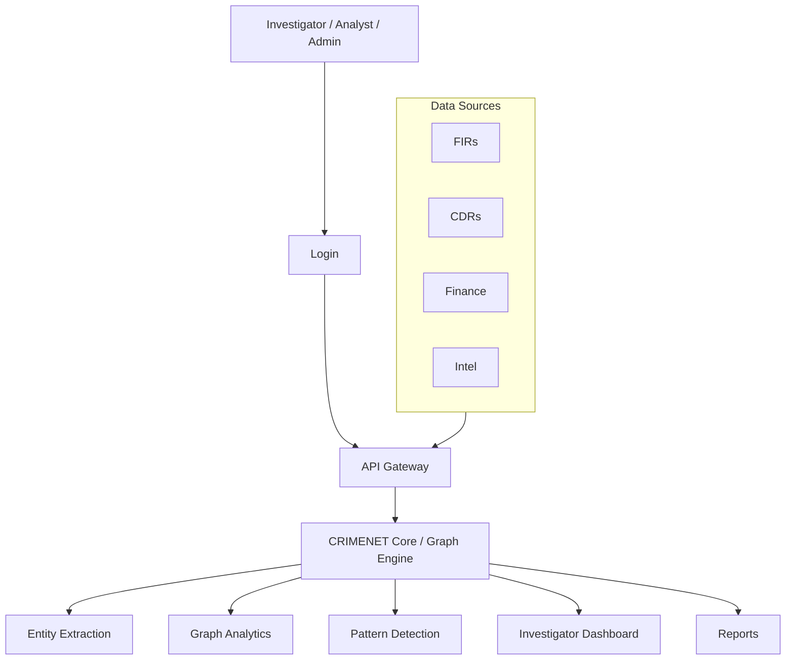

# CRIMENET — AI-Powered Criminal Network Analysis System

**Smart India Hackathon 2026**

```
Team Name                : Hack Pulse
Problem Statement ID     : 26189
Problem Statement Title  : AI-Powered Criminal Network Analysis System
Theme                    : Blockchain & Cybersecurity
Category                 : Software
Organization             : Ministry of Home Affairs
Department               : National Crime Records Bureau (NCRB), Women Safety Division
```

---

## 📌 Overview

CRIMENET is an AI-driven criminal intelligence and link analysis platform that helps investigators uncover hidden relationships across fragmented crime records — FIRs, Call Detail Records (CDRs), financial data, and intelligence inputs. Instead of relying on manual cross-referencing or opaque "black-box" risk scores, CRIMENET builds an explainable knowledge graph that shows investigators **why** a connection matters, not just that it exists.

> ⚠️ **Important:** CRIMENET is a decision-support tool. It surfaces evidence-backed leads for human investigators — it does not predict guilt or replace investigative judgment. All outputs are human-verified.

---

## 🚩 Problem Statement

### Background

Modern criminal activities are increasingly organized and interconnected. Criminals often operate through networks involving associates, intermediaries, financial channels, communication links, locations, and events. Law enforcement agencies collect large volumes of data from sources such as:

- FIRs and police reports
- Call Detail Records (CDRs)
- Financial transaction records
- Surveillance reports
- Social media intelligence
- Criminal history databases
- Intelligence agency reports

Despite having access to this information, investigators frequently struggle to identify hidden relationships among suspects because the data is fragmented, unstructured, and distributed across multiple systems. Manual analysis is slow, labor-intensive, and prone to missing critical connections. Advances in AI, Machine Learning, NLP, and Graph Analytics now make it possible to automatically discover relationships, detect patterns, and generate insights that assist investigators in understanding criminal networks more effectively.

### Core Challenges

- **Data Fragmentation** — records scattered across FIRs, CDRs, and financial systems
- **Manual Cross-Referencing** — slow, error-prone, and misses hidden links
- **Lack of Explainability** — existing tools output risk scores with no reasoning
- **Delayed Investigations** — manual pattern discovery can take days or weeks

### Objective

Develop an AI-powered system that analyzes large volumes of criminal and intelligence-related data to uncover hidden networks and relationships among individuals, organizations, locations, and events. The system should:

- Collect and process data from multiple sources
- Extract key entities — people, locations, vehicles, phone numbers, organizations
- Build relationship maps showing how entities are connected
- Identify key individuals who play influential roles within criminal networks
- Detect suspicious patterns and unusual activities
- Assist investigators with visual and analytical insights

### Expected Solution (as per problem statement)

An AI-powered system that automatically analyzes structured and unstructured crime-related data to uncover criminal networks, identify key influencers, detect suspicious patterns, and provide actionable intelligence for investigators.

---

## 💡 Proposed Solution

| Feature | Description |
|---|---|
| **AI Entity Extraction** | NLP-based extraction of people, phone numbers, vehicles, and accounts from raw records |
| **Knowledge Graph** | Links entities across FIRs, CDRs, and financial data into a unified graph |
| **Hidden Link Detection** | Automatically surfaces multi-hop relationships between entities |
| **Investigator Dashboard** | Visual graph exploration, timelines, evidence trails, and report generation |

---

## ✨ Novelty & Differentiators

| Existing Tools | CRIMENET |
|---|---|
| ❌ Black-box risk scores | ✅ Explainable, evidence-backed reasoning |
| ❌ Siloed single-source analysis | ✅ Multi-source graph fusion |
| ❌ No explainability | ✅ Human-verified investigation priority |
| ❌ Manual link discovery | ✅ Automated hidden-link discovery |

---

## 🏗️ Technical Architecture

### Process Flow



### Tech Stack

| Layer | Technology |
|---|---|
| **Frontend** | React.js (interactive dashboard), Cytoscape.js / D3.js (graph visualization) |
| **Backend** | Python + FastAPI (API orchestration) |
| **Graph Database** | Neo4j (entity/relationship storage, multi-hop queries) |
| **AI / NLP** | Transformer-based NER for entity extraction, fuzzy matching for identity resolution |
| **Graph Analytics** | Neo4j GDS / NetworkX (centrality, community detection, hidden-path discovery) |
| **AI Reasoning** | LLM-based agent to convert graph output into plain-language summaries |
| **Hosting & Deployment** | Cloud-based (AWS / Azure) |

---

## ✅ Feasibility & Viability

**Feasibility**
- Mature, proven tech stack (NER, Neo4j, graph algorithms)
- Hackathon-ready prototype buildable with synthetic data
- Scalable graph-based design supports future growth

**Challenges & Mitigation Strategies**

| Challenge | Strategy |
|---|---|
| No real police data available | Synthetic dataset generator mirroring FIR/CDR structures |
| Entity resolution complexity (same person, different appearances) | Fuzzy & rule-based matching with an ML roadmap |
| False positive risk | Human-in-the-loop review — provides leads, never automated accusations |

**Analysis**
- **Technical:** Neo4j, NLP, and graph analytics are proven and reliable
- **Operational:** Investigators already need centralized link analysis — adoption is practical
- **Economic:** Cloud-based deployment keeps infrastructure costs low and scalable

---

## 🌍 Impact & Benefits

| Stakeholder | Impact |
|---|---|
| **Investigators** | Faster, evidence-backed leads instead of manual cross-referencing |
| **Police Departments** | Reduced workload, standardized investigative reporting |
| **Judiciary** | Explainable, evidence-linked analysis supporting courtroom defensibility |
| **Public / Citizens** | Faster resolution of organized crime, stronger public safety |

**Key Benefits**
- **Social:** Faster resolution of organized crime, stronger public safety
- **Operational:** Reduced manual workload, standardized reporting
- **Analytical:** Surfaces hidden multi-hop connections and clusters
- **Judicial/Accountability:** Evidence-linked, human-verified, courtroom-defensible output

---

## 🔐 Ethics & Data Security

- Encryption and access control for sensitive data
- Human-verified outputs at every stage
- Onboarding and workflow support for investigator adoption
- AI assists investigators; **final decisions always remain human-verified**

---

## 📚 Research & References

**Academic Research**
- Burcher, M., & Whelan, C. (2018). *Social network analysis as a tool for criminal intelligence*, Trends in Organized Crime.

**Industry Reports & Case Studies**
- GraphAware (2026). *Criminal Network Analysis with LLMs and Knowledge Graphs.*
- Cognyte (2025). *AI and Crime: How AI is Advancing Crime Prevention.*
- SS8 Networks (2026). *Intellego XT — AI-powered investigative analytics platform.*

**Research Insights & Data**
- Europol — Internet Organised Crime Threat Assessment (IOCTA)
- ScienceDirect — Artificial intelligence powered crime scene analysis service
